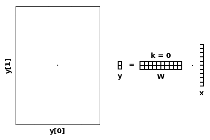
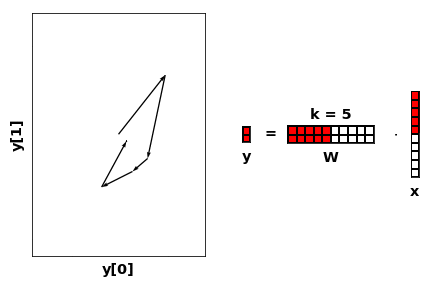
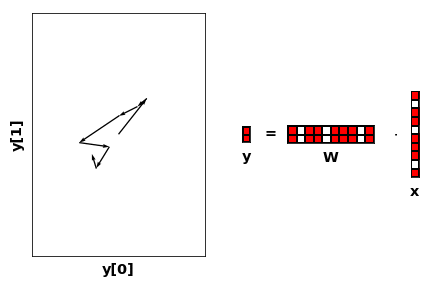
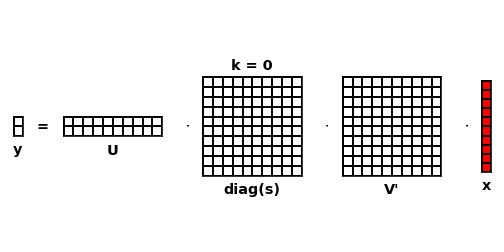
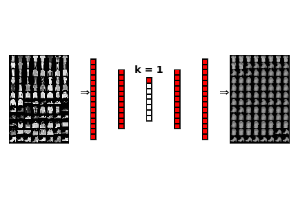

# TailDropout

Check out [example.ipynb](example.ipynb) or `test.py` and `test_performance.py` to get an idea how to use it. The idea is simple. At training time, only keep a random `k` first features. Results are as expected; this makes each layer learn features that are of additive importance, just like PCA.

### At inference time, choose either of k=1,... features
At each layer, a scalar input *feature* `x[j]` of an input feature vector `x` decides how far towards the direction `W[:,j]` of layer output space to go by scaling it `W[:,j]*x[j]`:


### While training, randomly sample k
Teach each **k first** directions to map input to target as good as possible.


Each direction has decreasing probability of being used.

### Compare to regular dropout
Teach each **subset of directions** to map input to targets as good as possible.


Each direction has same inclusion probability.

### Comparison to PCA
If `W` is some weights, then the SVD compression (same as PCA) is

```
W = torch.randn(2,10)
U,s,V = torch.svd(W)
W == U.mm(s.diag()).mm(V.t()) # ~True in theory
```
With `s` the eigenvalues of `W`. To use the `k` first *factors/components/eigenvectors* to represent `W`, set `s[k:]=0`. 



 <sub>Due to [Linear Algebra](https://en.wikipedia.org/wiki/Singular_value_decomposition), `s[2:]==0` would already be the case in example above. 
</sub>

Note that SVD compresses `W` optimally w.r.t the Euclidian norm `||W - U[:,:k] diag(s[:k]) V[:,:k]'||` for every `k`, but you want to compress each layer w.r.t the final loss function and lots of non-linearities in between!

### Example AutoEncoder; Sequential compression.
When using TailDropout on the embedding layer, `k` has a qualitative meaning:



Here even with `k=1` the resulting 1d-scalar embedding apparently separates shoes and shirts. 

## Usage
TailDropout is an `nn.Module` that works just like `nn.Dropout`, applied to a tensor `x`: 
```
from taildropout import TailDropout
dropout = TailDropout(p=0.5,batch_dim=0, dropout_dim=-1)
y = dropout(x)
```
See [example.ipynb](example.ipynb) for complete examples.

#### Pseudocode
```
# x = input from previous layer
# L = parameter controlling dropout-probability
for i in range(n_batch):
    k = ~Exponential(L)
    x[i,k:] = 0 
```
Note, the actual implementation is **much** faster, vectorized and made to be pytorch 0.2x, 0.3x, 0.4x, 1x GPU compatible. Tested for Pytorch <0.4.1 it yielded a significant speedup over regular dropout.

## Details
#### Training vs Inference
```
dropout = TailDropout()
dropout(x) # random
dropout.eval() 
dropout(x) # Identity function
dropout(x, n_used = k) # use first k features 
```

#### Sequences
"Recurrent dropout" == Keep mask constant over time. Popular approach.
```
x = torch.randn(n_timesteps,n_sequences,n_features)

gru = nn.GRU(n_features,n_features)
taildropout = TailDropout(batch_dim = 1, dropout_dim = 2)

x, _ = gru(x)
x = taildropout(x)
```
If you want to have mask vary for each timestep and sequence
```
taildropout = TailDropout(batch_dim = [0,1], dropout_dim = 2)
```

#### Images
"2d Dropout" == Keep mask constant over spatial dimension. Popular approach.
```
x = torch.randn(n_batch,n_features,n_pixels_x,n_pixels_y)

cnn = nn.Conv2d(n_features,n_features, kernel_size)
taildropout = TailDropout(batch_dim = 0, dropout_dim = 1)

x = cnn(x)
x = taildropout(x)
```

#### BatchNorm
Same as with regular dropout; batchnorm *before* dropout.
```
layer = nn.Sequential(
    nn.Linear(n_features,n_features),
    nn.BatchNorm1d(n_features),
    nn.ReLU(),
    TailDropout()
    )
```

##### Compression/regularization ratio is very large!
If you don't care much about regularization, dropout probability in order 1e-2 still 
seems to give good compression effect. I typically use `TailDropout(p=0.1)` to get both. 

#### Citation
```
@misc{Martinsson2018,
  author = {Egil Martinsson},
  title = {TailDropout},
  year = {2018},
  publisher = {GitHub},
  journal = {GitHub repository},
  howpublished = {\url{https://github.com/naver/taildropout}},
  commit = {master}
}
```
