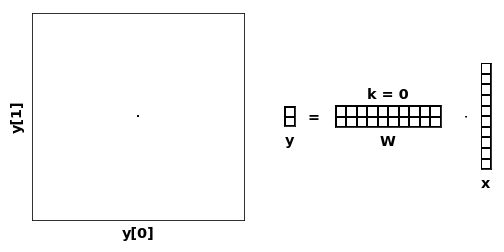

# TailDropout 
**"Improving neural networks by *enforcing* co-adaptation of feature detectors"**

#### Compression as an Optimization Problem

Imagine starting from an arbitrary layer of a neural network with input vector $h$ of dimension $n$:

$$
y = NN(h) 
$$

To set "compression" as an optimization problem we could pose it as 

> *"Hit the target as close as possible using* either $k=1,2,\dots$ or all $n$ *features"*

I.e learning a representation that is incrementally better the more features you add. Let's describe this as explicitly minimizing the weighted sum of the $n$ losses:

$$
\text{loss} = \sum_k^n \left\| y - NN\left(h \odot \mathbf{\vec{1}}_{k}\right) \right\|
$$

where $\mathbf{\vec{1}}_k$ is a binary mask zeroing out the vector "tail" after the $k$'th feature:

$$
\mathbf{\vec{1}}_k = 
\begin{pmatrix}
1 & 1 & 1 & 0 & 0 & \cdots & 0
\end{pmatrix}^T
$$

This would be a lot of forward passes (1 per feature) so what if we instead randomly sample $k$ with probability $p_k$:

$$
\underline{\overline{k}} \sim  \left\\{1,2,\dots,n \right\\}
$$

Doing so we see that in expectation (=large batchsize) we approximate the original objective:

$$
\mathbb{E}[\text{loss}] = \mathbb{E}\left[\left\| y - NN\left(h \odot \mathbf{\vec{1}}_{\underline{\overline{k}}}\right) \right\|\right]
$$

$$
 = \sum_k^n p_k \left\| y - NN\left(h * \mathbf{\vec{1}}_{k}\right) \right\| \\
$$


**And that's all there is to it!** 

I'll add details how we sample $k$ but the gist is that we sample a truncated (censored) exponential distribution [which I enjoy](https://github.com/ragulpr/wtte-rnn) doing and where this idea started from.

## Usage
TailDropout is a `nn.Module` with the same API as `nn.Dropout`, applied to a tensor `x`: 
```python
from taildropout import TailDropout
dropout = TailDropout(p=0.5,batch_dim=0, dropout_dim=-1)
y = dropout(x)
```
At training time, keep a random `k` first features. Results are as expected; this makes a layer learn features that are of additive importance, like PCA. 

See [example.ipynb](example.ipynb) for complete examples.
<!-- If we apply it to a linear network we actually learn PCA [TODO LINK](). -->

To use it for pruning or estimating the optimal size of hidden dim, calculate n_features vs loss and create a [scree plot](https://en.wikipedia.org/wiki/Scree_plot):

```python
losses = []
for k in range(n_features):
  model.dropout.set_k(k)
  losses.append(criterion(y, model(x)))

plt.plot(range(n_features), losses)
plt.title("Loss vs n_features used")
```

I'm happy to release this since I've found it very useful over the years. I've used it for 
* Estimating the optimal \#features per layer
* In place of dropout for regularization
* To be able to choose a model size (after training to overfit!) that generalizes.
* For fiddling with neural networks. (*"mechanistic interpretability"*)

The implementation is faster than `nn.Dropout`, supports multi-GPU and *torch.compile()*'s.

## Matrix multiplication 101
At each layer, a scalar input *feature* `x[j]` of a feature vector `x` decides how far to map input into the direction `W[:,j]` of the layer output space. This is done by `W[:,j]*x[j]`:


### TailDropout: While training, randomly sample k
Teach each **k first** directions to map input to target as good as possible.


Each direction has decreasing probability of being used.

### Compare to regular dropout
Teach each $2^n$ **subset of directions** to map input to targets as good as possible.


Each direction in W has same inclusion probability but there's $2^n$ combinations to learn.

Regular dropout [scales](https://pytorch.org/docs/stable/_modules/torch/nn/modules/dropout.html#Dropout) input by $\frac{1}{1-p}$ in `.eval()` mode meaning with $p=0.5$ we could train for an output magnitude ex $[0,2]$ but do inference on ex $[0,1]$ - a cause of much confusion and bugs. TailDropout does not scale differently between train / test.

### Comparison to PCA
If `W` is some weights, then the SVD compression (same as PCA) is
```
U, s, V = SVD(W)
assert W == U @ s @ V
```
<details> <summary></summary>

```python
W = torch.randn([2,10])
U, s, V = torch.linalg.svd(W)

s = torch.hstack([torch.diag(s), torch.zeros(2, 8)])

torch.testing.assert_close(
    W,
    U @ s @ V
)
```

</details>

With `s` the eigenvalues of `W`. To use the `k` first factors/ components/ eigenvectors to represent `W`, set `s[k:]=0`


Note that SVD compresses `W` optimally w.r.t the **Euclidian** (L2) norm for every `k`:
<!-- ```
||W - U[:,:k] diag(s[:k]) V[:,:k]'||
``` -->

$$
U, s, V = \arg\min_{U, s, V} \left\| Wx - U \, \text{diag}\left(s \odot \mathbf{\vec{1}}_{k}\right) V'x \right\|
$$

*but you want to compress each layer w.r.t the final loss function and lots of non-linearities in between!*

### Example AutoEncoder; Sequential compression.
When using TailDropout on the embedding layer, `k` controlls the compression rate:


Here even with `k=1` the resulting 1d-scalar embedding apparently separates shoes and shirts. 

Compare this to how regular dropout works. Well, it's quite more random.


## Details
#### Training vs Inference
```python
dropout = TailDropout()
dropout.train()
dropout(x) # random
dropout.eval() 
dropout(x) # Identity function
dropout.set_k(k)
dropout(x) # use first k features 
```
<!-- 
#### Sequences
"Recurrent dropout" == Keep mask constant over time. Popular approach.
```python
x = torch.randn(n_timesteps,n_sequences,n_features)

gru = nn.GRU(n_features,n_features)
taildropout = TailDropout(batch_dim = 1, dropout_dim = 2)

x, _ = gru(x)
x = taildropout(x)
```
If you want to have mask vary for each timestep and sequence
```python
taildropout = TailDropout(batch_dim = [0,1], dropout_dim = 2)
``` -->

#### Images
"2d Dropout" == Keep mask constant over spatial dimension. Popular approach.
```python
x = torch.randn(n_batch,n_features,n_pixels_x,n_pixels_y)

cnn = nn.Conv2d(n_features,n_features, kernel_size)
taildropout = TailDropout(batch_dim = 0, dropout_dim = 1)

x = cnn(x)
x = taildropout(x)
```

<!-- #### BatchNorm
Same as with regular dropout; batchnorm *before* dropout.
```python
layer = nn.Sequential(
    nn.Linear(n_features,n_features),
    nn.BatchNorm1d(n_features),
    nn.ReLU(),
    TailDropout()
    )
``` -->

##### Compression/regularization ratio is very large!
If you don't care much about regularization, dropout probability in order 1e-5 still 
seems to give good compression effect. I typically use `TailDropout(p=0.001)` to get both. 

<!-- #### Math
TODO
Intuitively, “earlier” features survive more often, while “later” features get zeroed‐out more often.
If we want `mask = dropout(x)` to have `mask.mean() == dropout.p`. It's incentivizing the model to learn an ordering of the features by importance.

Think of
```
F(k) = probability k<= F
``` -->

#### Citation
```
@misc{Martinsson2018,
  author = {Egil Martinsson},
  title = {TailDropout},
  year = {2018},
  publisher = {GitHub},
  journal = {GitHub repository},
  howpublished = {\url{https://github.com/naver/taildropout}},
  commit = {master}
}
```

#### Aknowledgments
This work was open sourced 2025 but work primarily done in 2018 at [Naver Clova/Clair](https://research.clova.ai/). Big thanks to [Minjoon Seo](https://seominjoon.github.io/) for the original inspiration from his work on [Skim-RNN](https://arxiv.org/abs/1711.02085) and [Ji-Hoon Kim](https://scholar.google.co.kr/citations?user=1KdhN5QAAAAJ&hl=ko) [Adrian Kim](https://scholar.google.co.kr/citations?user=l6lDgpgAAAAJ&hl=ko), [Jaesung Huh
](https://scholar.google.com/citations?user=VDMZ-pQAAAAJ&hl=en), [Prof. Jung-Woo Ha](https://scholar.google.com/citations?user=eGj3ay4AAAAJ&hl=en) and [Prof. Sung Kim](https://scholar.google.com/citations?user=JE_m2UgAAAAJ&hl=en) for valuable discussions and feedback.

I'm sure this simple idea has been implemented before 2018 (which I was unaware of at the time) or after (which I have not had time to look for). Please let me know if there's anything relevant I should cite.
