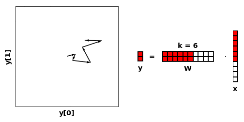

# TailDropout

Check out [examply.ipynb](examply.ipynb) or `test.py` and `test_performance.py` to get an idea how to use it. The idea is simple. At training time, only keep a random `k` first features. Results are as expected; this makes each layer learn features that are of additive importance, just like PCA.

### At inference time, choose either of k=1,... features
At each layer, for an input feature vector `x`, an input *feature* `x[j]` decides how far to go in the direction `w[:,j]` of layer output space.


### While training, randomly sample k
Each **k first** directions must map input to target as good as possible.

### Compare to regular dropout
Each **subset of directions** learns to map input to targets as good as possible.


### Example AutoEncoder; Sequential compression.
When using TailDropout, `k` has a qualitative meaning:


### Usage
dropout is an `nn.Module` that works just like `nn.Dropout`, applied to a tensor `x`: 
```
from taildropout import TailDropout
dropout = TailDropout(p=0.5,batch_dim=0, dropout_dim=1)
y = dropout(x)
```

### Pseudocode
```
# x = input from previous layer
# L = some parameter
for i in range(n_batch):
    k = ~Exponential(L)
    x[i,k:] = 0 
```
Note, the actual implementation is **much** faster, vectorized and pytorch 0.2x, 0.3x,0.4x,1x GPU compatible. For Pytorch <0.4.1 it yields a significant speedup over regular dropout.

More description to come.

#### Citation
```
@misc{Martinsson2018,
  author = {Egil Martinsson},
  title = {TailDropout},
  year = {2018},
  publisher = {GitHub},
  journal = {GitHub repository},
  howpublished = {\url{https://github.com/naver/taildropout}},
  commit = {master}
}
```
